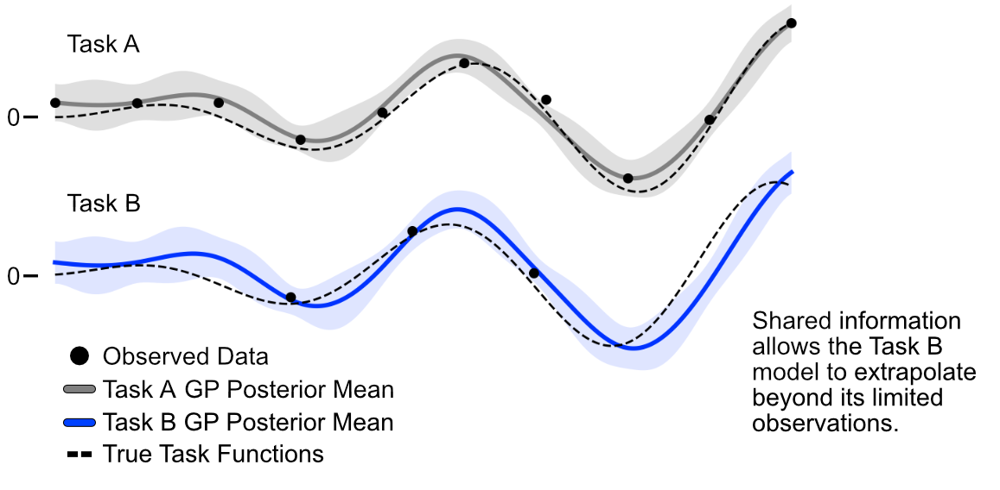
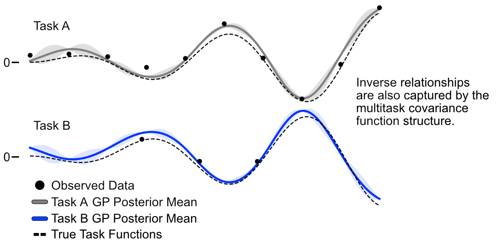
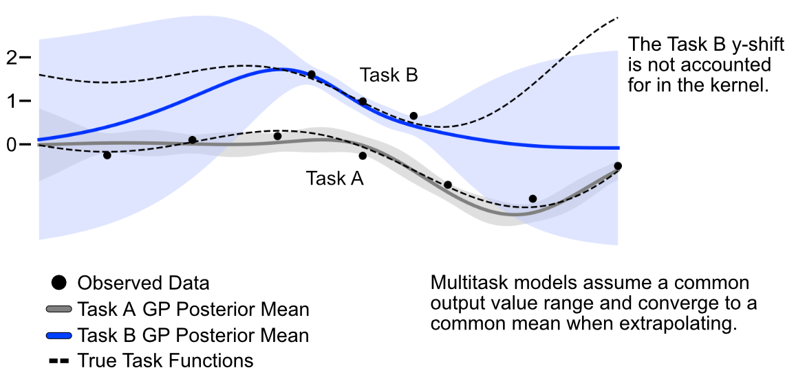
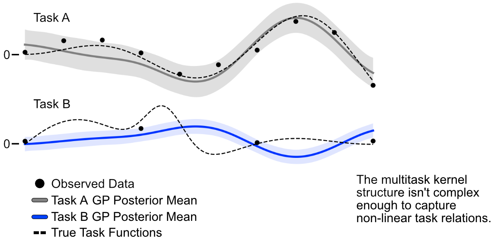

# Multitask Bayesian Optimization

Optimization tasks occasionally overlap in their design spaces and outputs. Consider a scenario where a company has constructed twin chemical reactors two facilities in different parts of the country. While the reactors are theoretically identical, they are likely to differ slightly in output due to inherent variations in construction and regional climate. Despite these differences, these devices are more alike than different, and learning the optimal set of parameters for one tells us something about the other. Multitask Bayesian optimization (MTBO) allows us to exploit these similarities and optimize both reactors in tandem, which proves much more efficient than optimizing each reactor independently.

The sharing of information between tasks is achieved through a unique covariance kernel design that models covariance between design points and between tasks. The mathematical structure of the kernel provided below:

$$K((x,t)(x',t')) = K_t(t,t') \circ K_x(x,x')$$

> Note: The literature typically uses the Kronecker product in defining this kernel, but as the Ax implementation relies on the Hadamard product, it has been expressed here.

Here $K$ is the covariance function that models the relations between points, $x$, in the design space and relations between tasks, $t$. The symbol $\circ$ denotes the Hadamard product, which indicates element-wise multiplication of covariance matrices. Practically, this kernel design allows the observations and model of one task to inform another via a multiplicative relationship.

An example of this shared information is shown in the figure below. Here, two functions, A and B, are modeled with slight offsets such that their peaks are close to each other but not exactly aligned. Ten noisy measurements have been made of Task A, whereas only three noisy observations have been made of Task B. The multitask kernel allows the information observed in Task A to inform the Task B model. This allows the Task B to more accurately extrapolate outside of its observed region.

As the kernel governing the relationship between tasks is modeling the covariance between tasks, it can also account for situations where one task is the inverse of another. In the figure below, the Task B function is exact inverse of Task A such that peaks of Task A are Task B's troughs. Regardless of this switch, the multitask kernel is able to model the relationship accurately.

The above scenarios have been structured such that a task with many observations informs one with few; however, this isn’t the only approach. However, tasks can also be explored simultaneously, with the insights from each task informing the other.

## Where Multitask Models go Wrong

While multi-task kernels are powerful, care should be taken when applying them to tasks that differ in the design and/or output space. As the kernel is solely multiplicative, there is no mathematical mechanism to accounting for differences in the mean function value of each task. As such, the predicted values of task models will converge to a common mean value under extrapolation conditions. In the figure below two tasks are modeled with Task B having a higher mean output value. Within the observation region, the Task B model captures this shift, but quickly collapses to the Task A observation mean further away from its observations. Such behavior can derail multitask optimization campaigns and reduce their efficiency.

It is worth noting that this issue can be fixed by modifying the kernel structure to model differences in task intercepts. However, this modification is beyond the scope of this concept document and the aims of Honegumi.

Multitask models also suffer when tasks differ significantly in their design spaces. Applying multitask models to design spaces with different topologies can point researchers in the wrong directions, especially when experimental observations are limited. The figure below shows the predictions of a multitask model for two completely different tasks. Notice that the information from Task A contributes little to the estimates for Task B, and creates an inaccurate representation.

## Is a Multitask GP Right For Your Problem?

There is increasing interest in leveraging historical data and shared information between tasks. However, the commonality between tasks isn't always clear. The optimal parameters of similar fabrication tools are likely similar, but the polymer formulation from the literature may differ significantly from what is optimal for your task of interest. Consider the extent to which two problems are correlated and whether that correlation is simple enough to be modeled with a multiplicative covariance function.

> **Want to see it in action?**\
Check out our multitask tutorial where we apply multitask optimization to the joint optimization of two ceramic slip systems.

## Additional Resources

Swersky K, Snoek J, Adams RP. Multi-task bayesian optimization. Advances in neural information processing systems. 2013. [🔗](https://proceedings.neurips.cc/paper/2013/hash/f33ba15effa5c10e873bf3842afb46a6-Abstract.html)

Bonilla EV, Chai K, Williams C. Multi-task Gaussian process prediction. Advances in neural information processing systems. 2007. [🔗](https://proceedings.neurips.cc/paper_files/paper/2007/hash/66368270ffd51418ec58bd793f2d9b1b-Abstract.html)

Gaussian Process Summer School: https://youtu.be/VAQRguYCoDI
