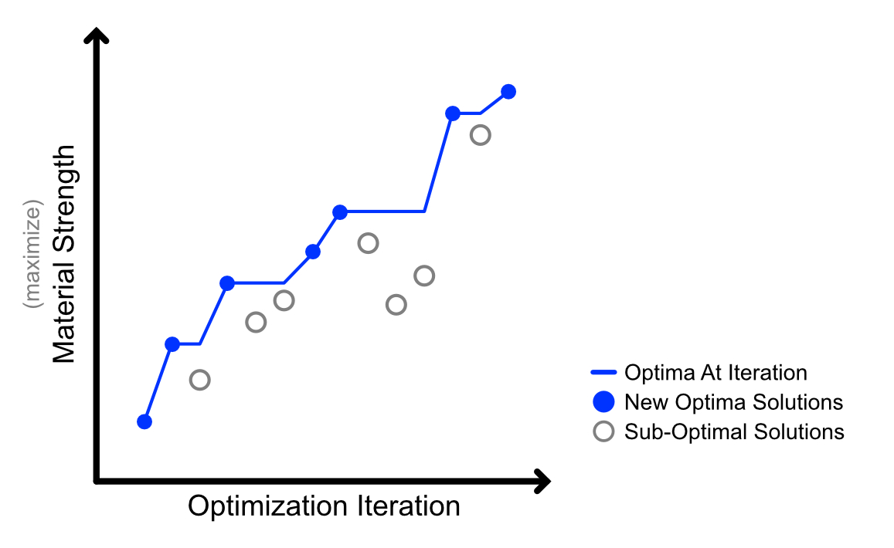
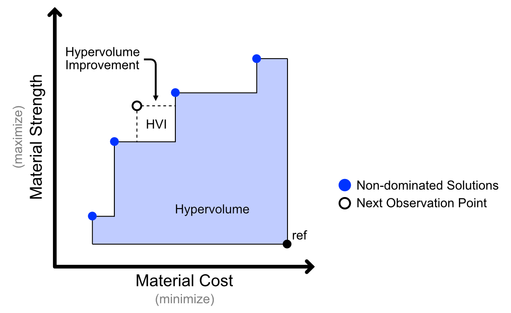

# Single- vs. Multi-Objective Optimization

Optimization theory is usually presented within the framework of maximizing or minimizing a single objective of interest. While single objective problems are conceptually easy to understand, real world problems often feature multiple, competing objectives that a researcher might be interested in accounting for in an optimization campaign. Although the shift from single- to multi-objective optimization is a simple linear increase in the number of objectives, the methods and interpretations of the results change dramatically. The sections below provide an overview of the key differences and considerations in selecting a single- vs. multi-objective bayesian optimization approach.

## Single-Objective Optimization

As the name implies, single-objective bayesian optimization aims to maximize or minimize a singular property of interest. It's the go-to method when you have both a clear goal and metric of success. For example, you many wish to optimize the ratio of constituents in a material to maximize its strength as measured by a flexural test. Under the single-objective framework, a probabilistic model is trained to predict the property of interest as a function of one or more inputs. At each optimization iteration, the model is used to predict a set of one or more optimal inputs. These are then evaluated (computationally or experimentally) and the results are integrated back into the model. As more data is observed, the model will become more accurate and return increasingly better input parameter predictions. Determining the best set of inputs is then a matter of selecting the set of inputs that return the best property value. The figure below shows a single-objective optimization trace where the best value observed at a given optimization iteration is tracked by the blue line.

## Multi-Objective Optimization

Imagine now that we are interested in optimizing a set of inputs for two or more properties simultaneously. Building on the previous example we might now want to maximize the strength of a material in addition to minimizing fabrication cost. A material that offers the highest strength might be prohibitively expensive, and conversely the most cost-effective material might be low strength. Thus, when considering multiple objectives, the question of the "best" set of inputs becomes more complicated and will likely be a compromise between the two objectives based on preferences and priorities.

When optimization preferences are known, a common approach is to combine several objectives into a single objective through a weighted sum, weighted product, or some other mathematical combination. This approach is called *scalarization* and is a means of encoding preferences into the optimization campaign and reducing problem complexity. However, such approaches risk biasing an optimization campaign towards a poor optimization region and limit fuller exploration of the tradeoffs between objectives.

Objective preferences may not be clearly defined, and researchers are often interested in learning the tradeoffs between the objectives so as to make an informed decision. Returning to the material optimization example, a researcher might be interested in determining the relative cost of an increase in material strength. In other words, we would like to know the boundary of the cost vs. strength compromise. This boundary is referred to as the *Pareto Front* and is defined by a set of non-dominated solutions - each of which cannot be improved in one objective without making another worse. Finding boundary of optimal trade-offs provides a holistic view of the solution space and allows researchers to make informed decisions based on their constraints and priorities. As such, many multi-objective optimization schemes aim to identify a set of Pareto optimal solutions as quickly as possible. The figure below shows a hypothetical Pareto front for our materials optimization example. The points along the blue, dashed line represent points of maximum tradeoff between our two objectives.

These Pareto optimal solutions are identified by optimizing a metric referred to as the hypervolume. The hyper volume is defined by the volume (or area in 2D) of the objective space that is dominated by a set of Pareto optimal solutions relative to a reference point. By expanding the Pareto front,  the measured hypervolume also expands, providing a convenient singular metric of the diversity and performance of a set of solutions. The goal of the multi-objective optimization campaign is then to identify points that will increase the size of the hypervolume, which will necessarily produce points that maximize objective tradeoffs. The figure below provides a visualization of a hypervolume in a multi-objective design space. The dashed square represents a computed improvement in the hypervolume if a predicted point was observed. This is the method by which the Pareto front is iteratively expanded.

## Which Approach is Right for Your Problem?

In deciding between single or multi-objective optimization, it's important to consider the complexity of your goals and the trade-off's you're willing to navigate. Single-objective optimization is straightforward, which makes the optimization process simpler, more interpretable, and often faster. However, in omitting competing objectives you may be oversimplify complex problems where multiple, often conflicting objectives must be balanced. Multi-objective optimization allows for the simultaneous consideration of several goals and the ability to learn the bounds on the tradeoffs between them. This, however, comes at a higher computational cost and  requires more sophisticated decision making processes for selecting the optimal solution. When other objectives, such as cost, can be directly computed, consider representing them in the form of a constraint rather than a separate objective.

> **Want to see them in action?**\
Check out our single and multi-objective optimization tutorials.

## Additional Resources

A. Agnihotri, Exploring Bayesian Optimization [🔗](https://distill.pub/2020/bayesian-optimization/)

P. Frazier, A Tutorial on Bayesian Optimization [🔗](https://arxiv.org/abs/1807.02811)

Ax Multi-Objective Optimization Tutorial [🔗](https://ax.dev/tutorials/multiobjective_optimization.html)
